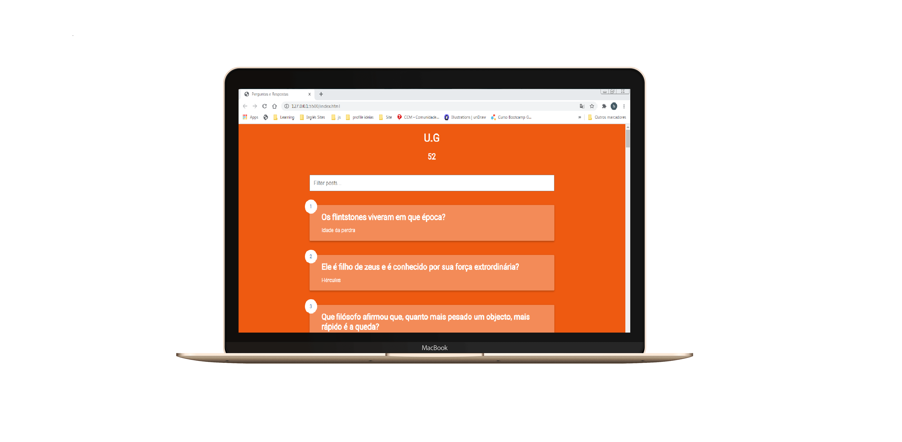

<h1 align="center">
    <span style="color: rgb(108, 99, 255);">U.G 👜</span>
</h1>

<h4 align="center">
   Development application ☕
</h4>


<p align="center">
  <a href="#uniplace-tecnologias">Tecnologias</a>&nbsp;&nbsp;&nbsp;|&nbsp;&nbsp;&nbsp;
  <a href="#-projeto">Projeto</a>&nbsp;&nbsp;&nbsp;|&nbsp;&nbsp;&nbsp;
  <a href="#-layout">Layout</a>&nbsp;&nbsp;&nbsp;|&nbsp;&nbsp;&nbsp;
  <a href="#-como-contribuir">Como contribuir</a>&nbsp;&nbsp;&nbsp;|&nbsp;&nbsp;&nbsp;
  <a href="#memo-licença">Licença</a>
</p>
<p align="center">
 


</p>
<br>

<p align="center">
  
</p>

## Pilhas: 
    * HTML5  | * CSS3
    * JS
## 💻 Projeto

Se estás aqui sabes o porque o projecto foi dado !
## 🔖 Layout

Layout foi desenvolvido no decorrer do desenvolvimento do projecto !

## 🤔 Como contribuir

- Faça um fork desse repositório;
- Cria uma branch com a sua feature: `git checkout -b minha-feature`;
- Faça commit das suas alterações: `git commit -m 'feat: Minha nova feature'`;
- Faça push para a sua branch: `git push origin minha-feature`.

Depois que o merge da sua pull request for feito, você pode deletar a sua branch.

Mais detalhado :

```bash
git clone https://github.com/HamiltonMassango/UG-COSA.git
cd UG-COSA
git checkout -b minha-feature
git commit -m 'feat: Minha nova feature'
git push origin minha-feature
```
Editar o arquivo perguntas.JSON :
```json
[{
  "pergunta" : "O que significa a sigla OUA ?",
  "resposta" : "Organização de Unidade Africana"
},
.
.
]
```
E manda :
```bash
git push origin minha-feature
```
## :memo: Licença

Esse projeto está sob a licença COSA. Veja o arquivo [LICENSE](LICENSE.md) para mais detalhes.

---

Feito com ♥ by Hamilton Silva :wave: [Entre na nossa comunidade!](https://www.facebook.com/groups/2330277530393634)

## Redes Socias 
- [Facebook](https://www.facebook.com/tiohs.u)
- [Linkdin](https://www.linkedin.com/in/hamilton-silva-502355195/)
